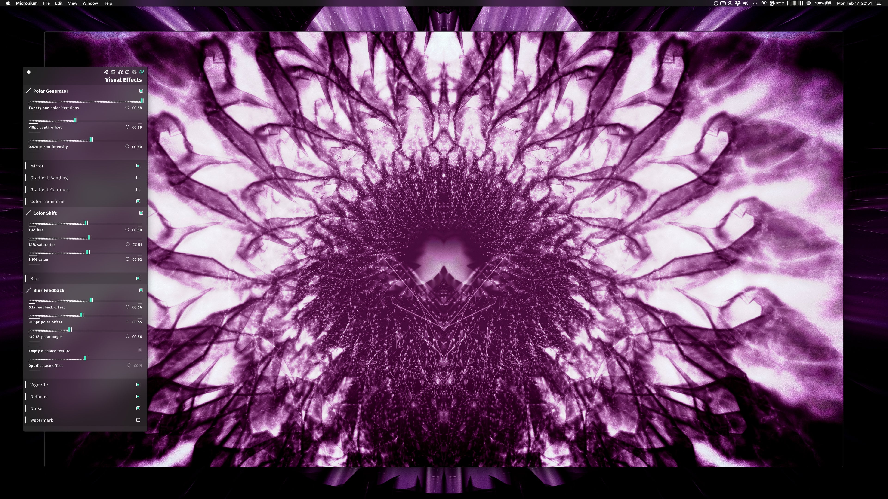

# Microbium

> Organic creature drawing and simulating toy for macOS.

## App Downloads

**[v1.0.0-beta-1 for macOS](https://microbiumapp.com/download/v1.0.0-beta-1)** – Released October 2019

## License

Microbium (c) 2017-2020 by Jay Weeks

Microbium is licensed under a
Creative Commons Attribution-NonCommercial-ShareAlike 4.0 International License.

You should have received a copy of the license along with this
work.  If not, see https://creativecommons.org/licenses/by-nc-sa/4.0/.

## Developing

### Build Setup

**Install dependencies**  
`yarn install`

**Run app in development mode**  
`yarn dev`

**Build packaged app**  
`yarn build`

**Run code style linter**  
`yarn lint`

